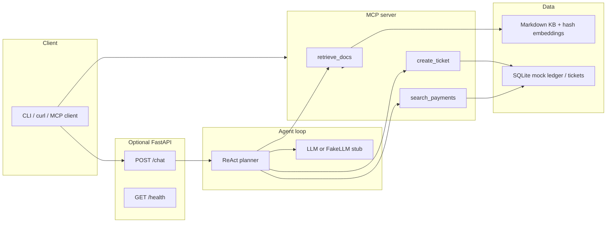

     **Model Context Protocol (MCP)** tools into an **agentic loop** for operations work: retrieve policy from a local knowledge base (RAG), search mock payments, and open tickets — the same shape as production copilots that sit in front of core banking / ops APIs, without any proprietary code.

This repository is original demo software by [Md Tanvir Alam](https://github.com/tanvir-ux). It uses generic payments, KYC, and interbank-messaging concepts only.

## Architecture



The MCP server and the HTTP agent share **one tool registry**. That is the production pattern: expose the same typed capabilities over stdio/SSE for IDE agents *and* over HTTP for a product UI.

## Quick start

Python 3.11+ (3.12/3.13 fine). No API key required.

```bash
python3 -m venv .venv
source .venv/bin/activate   # Windows: .venv\Scripts\activate
pip install -r requirements.txt

# tests — FakeLLM, hash embeddings, in-memory SQLite
pytest -q

# HTTP demo
cp .env.example .env
PYTHONPATH=src python -m uvicorn agentic_mcp_gateway.http_app:app --port 8080
```

Try a session:

```bash
curl -s localhost:8080/health
curl -s localhost:8080/chat -H 'content-type: application/json' \
  -d '{"message":"Find payment PMT-1002 and open a ticket if it is stuck"}'
```

MCP stdio (for Claude Desktop / Cursor-style clients):

```bash
PYTHONPATH=src python -m agentic_mcp_gateway.mcp_server
```

Docker:

```bash
docker compose up --build
# then the same curl against localhost:8080
```

## How MCP tools map to production

| Demo tool | What a real platform would wrap | Guardrails you would add |
| --- | --- | --- |
| `retrieve_docs` | Policy / product RAG over Confluence, runbooks, ISO 20022 notes | ACL per tenant, citation required, stale-doc TTL |
| `search_payments` | Read API over a payments bus or investigation store | Field-level masking, audit log, query cost limits |
| `create_ticket` | Case management / Jira / ServiceNow write path | Idempotency keys, maker-checker, PII scrubbing |

The agent is a small **ReAct** loop: think → pick a tool → observe → repeat, then answer. With `LLM_PROVIDER=fake` the planner is deterministic so CI never needs OpenAI. Set `LLM_PROVIDER=llm` and `OPENAI_API_KEY` to swap in a real chat model; the tool contracts stay identical.

Embeddings default to **hashed character n-grams** (numpy cosine). That is a documented demo fallback — swap `HashingEmbedder` for a sentence-transformer or vendor embedding API without changing the retriever interface.

## Project layout

```
src/agentic_mcp_gateway/   package
  tools/                   retrieve / payments / tickets
  agent.py                 ReAct + FakeLLM
  mcp_server.py            MCP stdio server
  http_app.py              FastAPI /chat
docs/kb/                   sample ops knowledge
tests/                     tool registry, RAG, mocked agent turn
```

## Author

**Md Tanvir Alam** — [github.com/tanvir-ux](https://github.com/tanvir-ux)

MIT licensed. Not affiliated with any bank or core-banking vendor.
